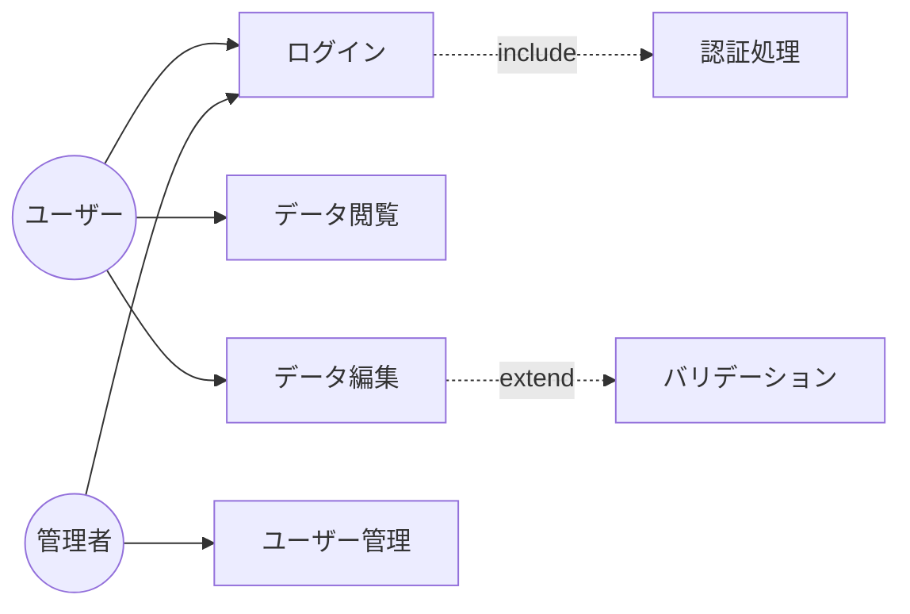
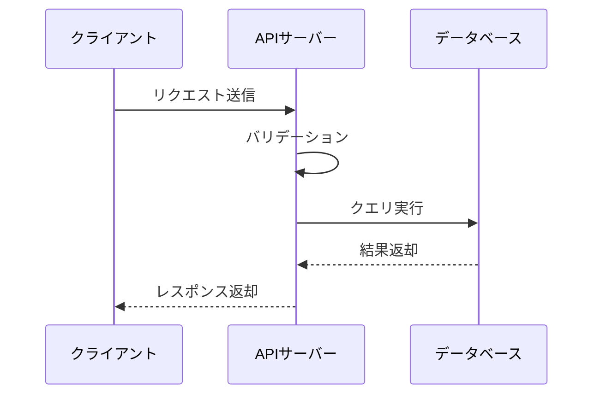
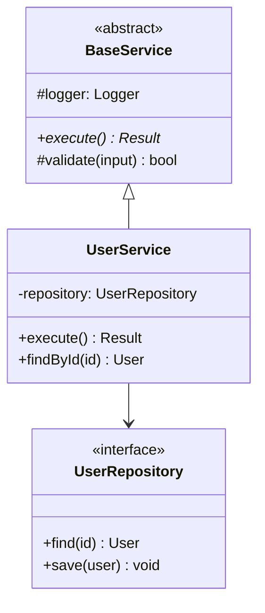
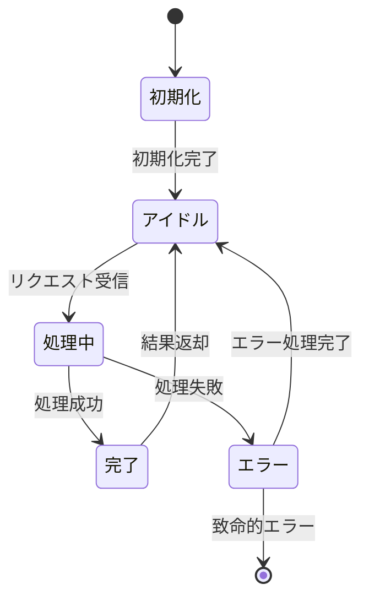

# Maestro — ソフトウェア開発エージェント契約書

> **このファイルは、すべてのAIコーディングエージェント（GitHub Copilot, Claude Code, Codex, Antigravity）が従うべき共通規約です。**

---

## 1. プロジェクト概要

Maestroは、ESPR 2.0（組込みシステム開発プロセス参照）のプロセスモデルを一般ソフトウェア開発に適用し、人間とAIが協働して高品質なソフトウェアを構築するためのフレームワークです。

### あなた（AIエージェント）の役割

- 要求のヒアリングと仕様化の支援
- USDM形式での要求仕様書の作成
- トレーサビリティタグを付加した成果物の生成
- 各工程のレビュー・指摘
- 知見ライブラリを活用した品質チェック
- 人間との対話を通じた協働開発

---

## 2. ESPR 2.0 プロセスフロー（V字モデル）

```
要求仕様定義 (SWP.1) ←――――――――――――→ 適格性確認テスト (SWP.6)
    ↓                                        ↑
方式設計 (SWP.2) ←――――――――――――→ 結合テスト (SWP.5)
    ↓                                    ↑
詳細設計 (SWP.3) ←――――――――→ 単体テスト (SWP.4)
    ↓                            ↑
    └──→ 製造（コーディング） ──→┘
```

### 各工程の定義

| 工程ID | 工程名 | 入力成果物 | 出力成果物 | テンプレート |
|--------|--------|------------|------------|-------------|
| SWP.1 | 要求仕様定義 | 顧客要求、制約事項 | 要求仕様書 | `docs/templates/requirements-spec.md` |
| SWP.2 | 方式設計 | 要求仕様書 | 方式設計書 | `docs/templates/architecture-design.md` |
| SWP.3 | 詳細設計 | 方式設計書 | 詳細設計書 | `docs/templates/detailed-design.md` |
| SWP.4 | 単体テスト | 詳細設計書、ソースコード | 単体テスト仕様書・結果 | `docs/templates/test-design.md` |
| SWP.5 | 結合テスト | 方式設計書 | 結合テスト仕様書・結果 | `docs/templates/test-design.md` |
| SWP.6 | 適格性確認テスト | 要求仕様書 | 適格性確認テスト仕様書・結果 | `docs/templates/test-design.md` |

---

## 3. トレーサビリティ規約

### タグ体系

すべての成果物にトレーサビリティタグを付与する。タグの書式:

```
[プレフィックス]-[連番3桁]  例: REQ-001
```

| プレフィックス | 対象 | 例 |
|------------|------|-----|
| `REQ` | 要求 | `REQ-001` |
| `SPEC` | 仕様（要求に紐づく） | `SPEC-001` |
| `ARC` | 方式設計要素 | `ARC-001` |
| `DET` | 詳細設計要素 | `DET-001` |
| `SRC` | ソースコード実装 | `SRC-001` |
| `UT` | 単体テストケース | `UT-001` |
| `IT` | 結合テストケース | `IT-001` |
| `QT` | 適格性確認テストケース | `QT-001` |

### トレース方向

```
REQ-001
  └─ SPEC-001, SPEC-002      (要求→仕様)
       └─ ARC-001             (仕様→方式設計)
            └─ DET-001        (方式設計→詳細設計)
                 ├─ SRC-001   (詳細設計→ソースコード)
                 └─ UT-001    (詳細設計→単体テスト)
       └─ IT-001              (仕様→結合テスト)
  └─ QT-001                   (要求→適格性確認テスト)
```

### タグ付与ルール

1. **新規成果物作成時**: 必ずトレーサビリティタグを付与する
2. **上位参照**: 各成果物に `traces-to:` フィールドで上位成果物タグを記載する
3. **ソースコード**: 関数・クラスのDocstring/コメントに `@trace DET-XXX` を記載する
4. **テストコード**: テスト関数名またはDocstringに `@trace UT-XXX` を記載する

---

## 4. USDM (Universal Specification Describing Manner) 規約

要求仕様はUSDM形式で記述する。各要求は以下の4要素を含む:

| 要素 | 説明 | 記述ルール |
|------|------|-----------|
| **要求** | 実現してほしいこと | 目的語＋動詞で簡潔に記述 |
| **理由** | なぜその要求が必要か | 背景・根拠を明記 |
| **説明** | 補足事項 | 用語定義、具体例、制約条件 |
| **仕様** | あるべき姿 | 検証可能な具体的記述 |

### 記述例

```markdown
### REQ-001: ユーザー認証機能

**要求**: システムはユーザーを認証できること

**理由**: 不正アクセスを防止し、ユーザーごとのデータを安全に管理するために、
本人確認の仕組みが必要である。

**説明**: 認証方式はメールアドレス＋パスワードを基本とし、将来的にOAuth連携も
検討する。パスワードはbcryptでハッシュ化して保存する。

#### 仕様

- **SPEC-001**: メールアドレスとパスワードによるログイン機能を提供する
  - traces-to: REQ-001
- **SPEC-002**: パスワードはbcrypt（コスト因子12以上）でハッシュ化して保存する
  - traces-to: REQ-001
- **SPEC-003**: ログイン失敗は5回連続でアカウントを30分間ロックする
  - traces-to: REQ-001
```

---

## 5. レビュー・品質チェック手順

### 成果物レビュー時の手順

1. 対象成果物のトレーサビリティタグの整合性を確認する
2. `knowledge/review-perspectives.md` の該当工程の観点表を参照する
3. `knowledge/trouble-cases.md` の関連事例を確認する
4. `knowledge/checklists.md` の該当工程チェックリストを使用する
5. 指摘事項にはレビュー指摘タグ `RV-XXX` を付与する

### レビュー指摘の重要度

| レベル | 意味 | 対応 |
|--------|------|------|
| **Critical** | 要求未充足・安全性問題 | 必ず修正 |
| **Major** | 設計不備・性能問題 | 修正推奨 |
| **Minor** | 記述改善・可読性 | 検討 |
| **Info** | 参考情報・提案 | 任意 |

---

## 6. 作業フロー

### 要求ヒアリング時

1. ゴール（達成したいこと）を聞き取る
2. リスク・制約条件を確認する
3. 機能要求と非機能要求を分離する
4. USDMフォーマットで要求仕様書を作成する
5. トレーサビリティタグを付与する

### 設計・製造時

1. 前工程の成果物を読み込む
2. 知見ライブラリを参照する
3. トレーサビリティタグを引き継いで新規成果物を作成する
4. 作成した成果物をレビュー観点表でセルフチェックする
5. トレーサビリティマトリクスを更新する

### レビュー依頼時

1. 依頼された成果物を読み込む
2. 前工程・次工程の成果物との整合性を確認する
3. レビュー観点表に基づいて指摘を行う
4. トラブル事例との類似性を確認する
5. 指摘一覧をレビュー指摘タグ付きで出力する

---

## 7. ディレクトリ構成

```
Maestro/
├── AGENTS.md                          # 本ファイル（共通エージェント契約）
├── CLAUDE.md                          # Claude Code向け設定
├── .github/
│   └── copilot-instructions.md        # GitHub Copilot向け設定
├── .agent/
│   └── workflows/
│       └── develop.md                 # Antigravity向けワークフロー
├── docs/
│   ├── templates/                     # 各工程テンプレート
│   │   ├── requirements-spec.md       # 要求仕様テンプレート (USDM)
│   │   ├── architecture-design.md     # 方式設計テンプレート
│   │   ├── detailed-design.md         # 詳細設計テンプレート
│   │   ├── test-design.md             # テスト設計テンプレート
│   │   └── traceability-matrix.md     # トレーサビリティマトリクス
│   └── projects/                      # 実際のプロジェクト成果物置き場
│       └── <project-name>/
│           ├── requirements/
│           ├── architecture/
│           ├── detailed-design/
│           ├── tests/
│           └── traceability/
├── knowledge/                         # 知見ライブラリ
│   ├── review-perspectives.md         # レビュー観点表
│   ├── trouble-cases.md               # トラブル事例集
│   └── checklists.md                  # 工程別チェックリスト
└── src/                               # ソースコード
```

---

## 8. 命名規則・用語集

| 用語 | 定義 |
|------|------|
| 要求 | ステークホルダーがシステムに求める事柄 |
| 仕様 | 要求を満たすためのシステムのあるべき姿 |
| トレーサビリティ | 成果物間の追跡可能性 |
| 方式設計 | システム全体の構造・方針を決定する設計 |
| 詳細設計 | モジュール・関数レベルの具体的設計 |
| 適格性確認 | 要求仕様を満たしているかの最終検証 |
| USDM | Universal Specification Describing Manner |
| V字モデル | 開発工程とテスト工程を対応させた開発モデル |
| TDD | テスト駆動開発（Test-Driven Development） |
| SBOM | ソフトウェア部品表（Software Bill of Materials） |
| CC | サイクロマティック複雑度（Cyclomatic Complexity） |

---

## 9. サブエージェント委譲設計（コンテキスト継続プロトコル）

### 目的

各工程のノウハウを蓄積しつつ、エージェント間（メインエージェント↔サブエージェント）でコンテキストが途切れないようにする。

### コンテキストファイル

工程を跨ぐ際、以下のファイルに **進行状態** を記録し、サブエージェントに引き継ぐ：

```
docs/projects/<project>/context/
├── project-context.md      # プロジェクト全体のコンテキスト
├── current-phase.md        # 現在の工程状態
├── decisions-log.md        # 設計判断の記録
└── handover-notes.md       # 引き継ぎメモ
```

### project-context.md の構造

```markdown
# プロジェクトコンテキスト

## プロジェクト概要
（1-2行で概要）

## 達成ゴール
- （箇条書き）

## 主要な制約・リスク
- （箇条書き）

## 完了済み工程
| 工程 | 成果物パス | 主要な判断事項 |
|------|-----------|-------------|

## 現在の工程
- 工程: SWP.X
- 状態: （作業中の内容）
- 次のアクション: （次にやるべきこと）

## 未解決課題
| 課題ID | 内容 | 優先度 | 担当 |
|--------|------|--------|------|
```

### サブエージェントへの委譲ルール

1. **委譲前に必ず `project-context.md` を更新する**
2. **委譲指示には以下を必ず含める**:
   - 読み込むべきファイル一覧（成果物＋コンテキスト）
   - 実行すべき工程とその完了基準
   - 参照すべき知見ライブラリ（`knowledge/` 配下）
   - 完了後に更新すべきファイル一覧
3. **サブエージェント完了後、必ず `decisions-log.md` に判断記録を追記する**

### 委譲指示テンプレート

```
## サブエージェントタスク: [工程名]

### コンテキスト読み込み（必須）
- docs/projects/<project>/context/project-context.md
- docs/projects/<project>/context/decisions-log.md
- [前工程の成果物パス]

### 参照すべき知見
- knowledge/review-perspectives.md（該当セクション）
- knowledge/trouble-cases.md（関連カテゴリ）
- knowledge/checklists.md（該当工程チェックリスト）
- knowledge/security-standards.md（該当言語セクション）

### 実行内容
1. [具体的な作業指示]
2. [トレーサビリティタグの付与]
3. [Mermaid図の作成]

### 完了基準
- [ ] [成果物の完成条件]
- [ ] [チェックリストの全項目クリア]

### 完了後の更新
- docs/projects/<project>/context/project-context.md（完了済み工程に追加）
- docs/projects/<project>/context/decisions-log.md（判断記録追記）
- docs/templates/traceability-matrix.md のプロジェクト版を更新
```

---

## 10. Mermaid UML図 規約

### 設計・テスト工程で使用するUML図

各工程で **Mermaid記法** を使い、以下のUML図を作成すること:

| 工程 | 必須図 | 推奨図 |
|------|--------|--------|
| SWP.1 要求仕様 | ユースケース図 | — |
| SWP.2 方式設計 | コンポーネント図、シーケンス図 | 配置図 |
| SWP.3 詳細設計 | クラス図、状態遷移図 | アクティビティ図 |
| SWP.4 単体テスト | — | シーケンス図（モック連携） |
| SWP.5 結合テスト | シーケンス図 | — |

### Mermaid記法サンプル

#### ユースケース図（要求仕様）



#### シーケンス図（方式設計・結合テスト）



#### クラス図（詳細設計）



#### 状態遷移図（詳細設計）



---

## 11. TDD（テスト駆動開発）ワークフロー

### 原則: Red → Green → Refactor

```
1. RED:    詳細設計書をインプットに、テストを先に書く（テストは失敗する）
2. GREEN:  テストを満たす最小限のコードを書く
3. REFACTOR: コード品質規約（Section 12）を満たすようリファクタリング
```

### 具体的な作業手順

#### Step 1: 詳細設計書からテスト仕様を作成

```
DET-001 の関数仕様 → UT-001 テストケースを作成
  - 正常系テスト
  - 異常系テスト（例外、バリデーションエラー）
  - 境界値テスト
```

#### Step 2: テストコードを先に実装（RED）

```python
# @trace UT-001
def test_create_user_with_valid_data():
    """正常系: 有効なデータでユーザーが作成されること"""
    service = UserService(mock_repository)
    result = service.create(name="テスト太郎", email="test@example.com")
    assert result.success is True
    assert result.user.name == "テスト太郎"
```

#### Step 3: テストを実行して失敗を確認（RED確認）

```bash
# テストが失敗することを確認
pytest tests/ -v  # すべて FAILED
```

#### Step 4: テストを通す最小限の実装（GREEN）

```python
# @trace DET-001, SRC-001
class UserService:
    """ユーザーサービス: ユーザーの作成・管理を行う"""
    def create(self, name: str, email: str) -> Result:
        # テストを通す最小限の実装
        ...
```

#### Step 5: テスト合格を確認

```bash
pytest tests/ -v  # すべて PASSED
```

#### Step 6: リファクタリング（REFACTOR）

- Section 12 のコード品質規約を適用
- テストが引き続きPASSすることを確認

---

## 12. コード品質規約

### 関数サイズ制限

| 項目 | 制限値 | 例外 |
|------|--------|------|
| 関数の行数 | **100行以内** | 変数の列挙（定数定義、enum等）は除外可 |
| サイクロマティック複雑度 (CC) | **50以内** | — |

### 制限超過時の対応

1. **意図を変えずに**関数を分割する
2. 分割した関数にも適切な名前とDocstringを付与する
3. トレーサビリティタグは分割先にも引き継ぐ
4. 分割後のテストが既存テストと同等のカバレッジを維持すること

### CC計測コマンド例

| 言語 | ツール | コマンド |
|------|--------|---------|
| Python | radon | `radon cc src/ -a -nc` |
| JavaScript/TypeScript | escomplex | `cr src/` |
| Java | PMD | `pmd check -d src/ -R category/java/design.xml` |
| C/C++ | lizard | `lizard src/` |
| Go | gocyclo | `gocyclo -over 50 .` |
| Rust | rust-code-analysis | `rust-code-analysis-cli -m -p src/` |

### Docstring規約

すべての関数・クラスに以下を含むDocstringを記述する（日本語で）:

```python
def calculate_price(base_price: int, tax_rate: float, discount: int = 0) -> int:
    """
    商品の税込価格を計算する。

    基本価格に税率を適用し、割引額を差し引いた最終価格を返す。
    価格は整数に切り上げる（消費者有利の端数処理）。

    @trace DET-003

    Args:
        base_price: 基本価格（税抜）。0以上の整数。
            制約: 0 <= base_price <= 999_999_999
        tax_rate: 税率。0.0〜1.0の範囲の浮動小数点数。
            制約: 0.0 <= tax_rate <= 1.0
            例: 消費税10% → 0.10
        discount: 割引額（税抜価格からの差引額）。デフォルト0。
            制約: 0 <= discount <= base_price

    Returns:
        税込最終価格（整数、切り上げ）。最小値は0。

    Raises:
        ValueError: base_priceが負の値の場合
        ValueError: tax_rateが0.0〜1.0の範囲外の場合
        ValueError: discountがbase_priceを超える場合
    """
```

---

## 13. セキュリティコーディング規約

### 言語別セキュリティ標準

対象プロジェクトの言語に応じて、以下のセキュリティコーディング標準を適用する:

| 言語 | 適用標準 | 要チェック観点 |
|------|---------|-------------|
| Python | [OWASP Python Security](https://owasp.org/www-project-python-security/) | インジェクション、デシリアライズ、パス操作 |
| JavaScript/TS | [OWASP Node.js Security Cheat Sheet](https://cheatsheetseries.owasp.org/cheatsheets/Nodejs_Security_Cheat_Sheet.html) | XSS、プロトタイプ汚染、依存関係 |
| Java | [SEI CERT Oracle Coding Standard for Java](https://wiki.sei.cmu.edu/confluence/display/java) | 入力検証、例外処理、並行処理 |
| C/C++ | [SEI CERT C/C++ Coding Standard](https://wiki.sei.cmu.edu/confluence/display/c) | バッファオーバーフロー、メモリ管理、整数オーバーフロー |
| Go | [OWASP Go Security Cheat Sheet](https://cheatsheetseries.owasp.org/cheatsheets/Go_Security.html) | 入力検証、暗号化、エラー処理 |
| Rust | [Rust Secure Coding Guidelines](https://anssi-fr.github.io/rust-guide/) | unsafe使用制限、パニック回避 |

### 共通セキュリティルール（全言語）

1. **入力バリデーション**: すべての外部入力を信頼しない。型・範囲・長さ・形式を検証する
2. **出力エスケープ**: 出力先に応じたエスケープ（HTML、SQL、OS コマンド等）を行う
3. **認証・認可**: 最小権限の原則を適用する
4. **秘密情報**: ハードコードしない。環境変数またはシークレットマネージャーを使用する
5. **ログ**: 機密情報（パスワード、トークン、個人情報）をログに出力しない
6. **暗号化**: 非推奨アルゴリズム（MD5、SHA-1、DES等）を使用しない
7. **依存関係**: 既知の脆弱性を持つライブラリを使用しない（Section 15参照）

### セキュリティチェック自動化

```bash
# Python
bandit -r src/ -f json -o security-report.json
safety check --json --output security-report-deps.json

# JavaScript/TypeScript
npm audit --json > security-report.json

# Java
mvn dependency-check:check

# Go
govulncheck ./...
```

---

## 14. テストダブル規約（Mock / Stub / Driver）

### テストダブルの種類と使い分け

| 種類 | 目的 | 使用場面 |
|------|------|---------|
| **Mock** | 呼び出しの検証（期待する呼び出しがされたか） | 外部API呼び出し、メール送信等の副作用の検証 |
| **Stub** | 固定値の返却（テスト対象に必要な入力を提供） | DB問合せ結果の差し替え、設定値の固定化 |
| **Driver** | テスト対象を呼び出す側の代替 | 下位モジュール単体テスト時の上位呼出し模擬 |
| **Spy** | 実際の処理を実行しつつ呼び出しを記録 | ログ出力の検証、イベント発火の確認 |
| **Fake** | 簡易版の実装（インメモリDB等） | 統合テスト時のDB差し替え |

### テストダブル設計ルール

1. **Mock/Stubはインターフェースに対して作成する**（具象クラスに直接モックしない）
2. **テストダブルにもトレーサビリティタグを付与する**
3. **テストダブルの振る舞いをテスト仕様書に記載する**
4. **テストダブルが実際のインターフェース契約に準拠していることを確認する**

### テストダブル記述例（Python）

```python
# @trace UT-001 (Mock: UserRepository)
class MockUserRepository:
    """UserRepositoryのモック実装。テスト用に固定データを返す。"""
    
    def __init__(self):
        self.saved_users: list[User] = []
        self.find_called_count: int = 0
    
    def find(self, user_id: str) -> User | None:
        """Stub: 固定ユーザーを返す"""
        self.find_called_count += 1
        if user_id == "existing-id":
            return User(id="existing-id", name="テスト太郎")
        return None
    
    def save(self, user: User) -> None:
        """Mock: 保存呼出しを記録"""
        self.saved_users.append(user)
```

### テスト構成例

```
tests/
├── unit/                    # 単体テスト
│   ├── test_user_service.py
│   └── doubles/             # テストダブル
│       ├── mock_user_repository.py
│       └── stub_external_api.py
├── integration/             # 結合テスト
│   ├── test_user_flow.py
│   └── fakes/
│       └── fake_database.py
└── qualification/           # 適格性確認テスト
    └── test_requirements.py
```

---

## 15. OSS管理・SBOM・脆弱性管理（EU CRA準拠）

> **適用規格**: EU Cyber Resilience Act (Regulation 2024/2847)
> 2027年12月11日までにすべてのデジタル製品で準拠が必要。

### OSS選定ルール

1. **致命的な脆弱性（Critical/High）が未修正のOSSは使用禁止**
2. 選定時に以下を **すべて** 確認する:

| 確認項目 | 基準 | NOASSERTION不可 |
|---------|------|----------------|
| コンポーネント名 | 正式名称を記録 | ✅ |
| バージョン | 使用している正確なバージョン | ✅ |
| サプライヤー（開発元） | 組織名または個人名 | ✅ |
| ライセンス | SPDX License Identifier で記録（例: `MIT`, `Apache-2.0`） | ✅ |
| 入手先URL | パッケージレジストリまたはリポジトリのURL | ✅ |
| 既知の脆弱性 | CVE/NVDで Critical/High が未修正でないこと | — |
| メンテナンス状況 | 直近1年以内にリリースがあること | — |
| コミュニティ | GitHub Stars 100以上 または 信頼できる組織が管理 | — |
| ライセンス互換性 | プロジェクトのライセンスと互換性があること | — |

### SBOM出力形式（3形式必須）

すべてのSBOMは以下の **3形式** で出力する:

| 形式 | フォーマット | 用途 | ツール |
|------|-----------|------|--------|
| **SPDX 3.0** | JSON (`.spdx.json`) | 規制当局への提出、国際標準準拠 | Microsoft SBOM Tool / spdx-tools |
| **CycloneDX 1.6** | JSON (`.cdx.json`) | 脆弱性管理ツール連携、VEX対応 | Syft / CycloneDX CLI |
| **CSV** | CSV (`.csv`) | 人間による確認・レビュー | JSON → CSV 変換スクリプト |

### SBOM CSV項目（人間可読形式）

CSV形式のSBOMには以下の項目を必ず含める:

```csv
コンポーネント名,バージョン,ライセンス,サプライヤー,入手先URL,パッケージ種別,直接/間接依存,ハッシュ(SHA-256)
requests,2.31.0,Apache-2.0,Kenneth Reitz / PSF,https://pypi.org/project/requests/,pypi,direct,a1b2c3d4...
```

| CSV項目 | 説明 | NOASSERTION許容 |
|---------|------|:---:|
| コンポーネント名 | パッケージ正式名 | ❌ |
| バージョン | 使用バージョン（セマンティックバージョニング） | ❌ |
| ライセンス | SPDX License Identifier | ❌ |
| サプライヤー | 開発組織名/個人名 | ❌ |
| 入手先URL | レジストリURL / リポジトリURL | ❌ |
| パッケージ種別 | pypi / npm / maven / go / crate 等 | ❌ |
| 直接/間接依存 | direct（直接） / transitive（間接） | ❌ |
| ハッシュ(SHA-256) | パッケージの完全性検証用 | ❌ |

### NOASSERTION排除プロセス

**SBOMにおいて `NOASSERTION`（情報不明）は原則として許容しない。** 以下の多段階プロセスで情報を確定させる:

```
Step 1: lockファイル解析
  └─ バージョン、直接/間接依存の特定
  
Step 2: パッケージレジストリAPI照会
  ├─ PyPI API: https://pypi.org/pypi/{name}/{version}/json
  ├─ npm Registry: https://registry.npmjs.org/{name}/{version}
  ├─ Maven Central: https://search.maven.org/solrsearch/select?q=...
  ├─ pkg.go.dev: https://pkg.go.dev/{module}@{version}
  └─ crates.io: https://crates.io/api/v1/crates/{name}/{version}
  └─ ライセンス、サプライヤー、入手先URLを取得

Step 3: リポジトリ直接調査（Step 2で不足がある場合）
  ├─ LICENSE / COPYING ファイルの確認
  ├─ package.json / setup.py / Cargo.toml 等のメタデータ確認
  └─ README / NOTICE ファイルの著作権表示確認

Step 4: 手動確認（Step 3でも不足がある場合）
  ├─ プロジェクトWebサイトでのライセンス表示確認
  ├─ メーリングリスト / Issue Tracker での公式見解確認
  └─ 見つからない場合は「REVIEW-REQUIRED」として記録し、人間の確認を要求
```

### 脆弱性レポート出力形式

脆弱性スキャン結果は **JSON** と **CSV** の両形式で出力する:

#### JSON形式（ツール連携用）

```json
{
  "scan_date": "2025-01-15T09:00:00Z",
  "tool": "trivy",
  "total_vulnerabilities": 3,
  "vulnerabilities": [
    {
      "id": "CVE-2024-XXXXX",
      "severity": "HIGH",
      "component": "package-name",
      "version": "1.2.3",
      "fixed_version": "1.2.4",
      "description": "...",
      "reference": "https://nvd.nist.gov/vuln/detail/CVE-2024-XXXXX"
    }
  ]
}
```

#### CSV形式（人間確認用）

```csv
CVE-ID,深刻度,コンポーネント,現バージョン,修正バージョン,説明,参照URL,対応状況
CVE-2024-XXXXX,HIGH,package-name,1.2.3,1.2.4,説明文,https://nvd.nist.gov/...,未対応
```

### SBOM品質検証ルール

CI/CDパイプラインで以下の品質チェックを自動実行する:

| チェック項目 | 条件 | 違反時のアクション |
|------------|------|:---:|
| NOASSERTION検出 | ライセンス/サプライヤー/入手先が NOASSERTION | ❌ ビルド失敗 |
| ライセンス互換性 | Copyleft系ライセンスの混入 | ⚠️ 警告 |
| 脆弱性（Critical） | CVSS 9.0以上 | ❌ ビルド失敗 |
| 脆弱性（High） | CVSS 7.0以上 | ⚠️ 警告 |
| ハッシュ不一致 | 配布パッケージの改ざん疑い | ❌ ビルド失敗 |

### SBOM生成ツール（言語別）

| 言語 | lockファイル | CycloneDX 1.6 | SPDX 3.0 |
|------|------------|---------------|----------|
| Python | `requirements.txt` / `poetry.lock` | Syft / `cyclonedx-py` | Microsoft SBOM Tool |
| JavaScript/TS | `package-lock.json` / `yarn.lock` | Syft / `cyclonedx-npm` | Microsoft SBOM Tool |
| Java | `pom.xml` / `build.gradle.lock` | Syft / `cyclonedx-maven` | Microsoft SBOM Tool |
| Go | `go.sum` | Syft / `cyclonedx-gomod` | Microsoft SBOM Tool |
| Rust | `Cargo.lock` | Syft / `cyclonedx-rust-cargo` | Microsoft SBOM Tool |

### CI/CDでの自動チェック

- `.github/workflows/security.yml` — GitHub Actions用セキュリティパイプライン
- `.gitlab-ci-security.yml` — GitLab CI用セキュリティパイプライン
- 詳細は各ファイルを参照

### ThirdPartyLicense（EU CRA準拠）

使用するすべてのOSSのライセンス情報を `THIRD_PARTY_LICENSES` ファイルに集約する。以下を必ず含める:

| 必須項目 | 説明 |
|---------|------|
| コンポーネント名 | 正式名称 |
| バージョン | 使用バージョン |
| ライセンス | SPDX License Identifier |
| サプライヤー | 開発組織名/個人名 |
| 入手先URL | パッケージレジストリ/リポジトリURL |
| ライセンス本文 | ライセンス条文全文またはURL |

---

## 16. ディレクトリ構成（更新版）

```
Maestro/
├── AGENTS.md                          # 共通エージェント契約
├── CLAUDE.md                          # Claude Code向け設定
├── README.md                          # プロジェクト概要
├── THIRD_PARTY_LICENSES               # OSSライセンス一覧（CRA準拠）
├── .github/
│   ├── copilot-instructions.md        # GitHub Copilot向け設定
│   └── workflows/
│       └── security.yml               # セキュリティCI/CD
├── .gitlab-ci-security.yml            # GitLab CI セキュリティ
├── .agent/
│   └── workflows/
│       └── develop.md                 # Antigravity向けワークフロー
├── docs/
│   ├── templates/                     # 各工程テンプレート
│   │   ├── requirements-spec.md       # 要求仕様テンプレート (USDM)
│   │   ├── architecture-design.md     # 方式設計テンプレート
│   │   ├── detailed-design.md         # 詳細設計テンプレート
│   │   ├── test-design.md             # テスト設計テンプレート
│   │   ├── traceability-matrix.md     # トレーサビリティマトリクス
│   │   ├── consistency-review.md      # 整合性レビューテンプレート
│   │   └── conversation-log.md        # 対話ログテンプレート
│   └── projects/                      # プロジェクト成果物
│       └── <project-name>/
│           ├── requirements/
│           ├── architecture/
│           ├── detailed-design/
│           ├── tests/
│           ├── traceability/
│           ├── context/               # コンテキスト継続ファイル
│           │   ├── project-context.md
│           │   ├── current-phase.md
│           │   ├── decisions-log.md
│           │   └── handover-notes.md
│           └── logs/                  # 対話ログ
│               ├── conversation-index.md
│               └── YYYY-MM-DD_NNN_*.md
├── knowledge/                         # 知見ライブラリ
│   ├── review-perspectives.md         # レビュー観点表
│   ├── trouble-cases.md               # トラブル事例集
│   └── checklists.md                  # 工程別チェックリスト
├── src/                               # ソースコード
└── tests/                             # テストコード
    ├── unit/
    │   └── doubles/                   # Mock/Stub/Driver
    ├── integration/
    │   └── fakes/
    └── qualification/
```

---

## 17. 成果物間 整合性レビュー

### 目的

人間が作成した企画書や仕様書と、他の成果物やエージェントが生成した成果物との間に**矛盾・不整合・齟齬**がないかを体系的にチェックする。

### 整合性チェック対象ペア

| チェック元 | チェック先 | チェック観点 |
|----------|----------|-----------|
| 企画書 | 要求仕様書 | 機能スコープの一致、目的・ゴールの一貫性 |
| 企画書 | 方式設計書 | 技術選定が企画の制約と整合しているか |
| 要求仕様書 | 方式設計書 | 全要求がアーキテクチャで実現可能か |
| 要求仕様書 | テスト設計書 | 全要求に対応するテストケースが存在するか |
| 方式設計書 | 詳細設計書 | コンポーネント分割・IF定義の整合性 |
| 詳細設計書 | ソースコード | 設計書の仕様通りに実装されているか |
| 非機能要求 | 方式設計書 | 性能・セキュリティ要件が設計に反映されているか |

### 整合性チェック観点

#### A. 用語の統一性

- 同じ概念に対して異なる用語が使われていないか
- 略語の定義が統一されているか
- 例: 企画書で「ユーザー」、仕様書で「利用者」、設計書で「アカウント」→ 要統一

#### B. 数値・定量基準の一貫性

- パフォーマンス目標値（レスポンスタイム、スループット等）が文書間で一致しているか
- 容量・サイズの制限値が一致しているか
- 例: 企画書「応答時間3秒以内」、要求仕様書「レスポンスタイム5秒以内」→ 不整合

#### C. 機能範囲（スコープ）の整合性

- 企画書に記載された機能がすべて要求仕様書に含まれているか
- 要求仕様書に企画書にない機能が追加されていないか（スコープクリープ）
- 削除・延期された機能が明示的に記録されているか

#### D. 非機能要求の反映

- セキュリティ要件が設計に反映されているか
- 可用性・信頼性の要件が設計に反映されているか
- 性能要件を満たす技術選定になっているか

#### E. 前提条件・制約の継承

- 企画書の前提条件が後続文書で無視されていないか
- 技術的制約が設計に正しく反映されているか
- ビジネス上の制約（予算、期限、人員）が考慮されているか

### 矛盾検出時の報告フォーマット

```markdown
## 整合性レビュー報告

### 矛盾・不整合一覧

| ID | 深刻度 | チェック元 | チェック先 | 不整合の内容 | 推奨対応 |
|----|--------|----------|----------|-----------|---------|
| CR-001 | 🔴 重大 | 企画書 p.3 | 要求仕様書 REQ-005 | 企画書では「月間100万PV対応」と記載されているが、非機能要求に性能要件が未定義 | 非機能要求に具体的な性能要件を追加 |
| CR-002 | 🟡 注意 | 要求仕様書 SPEC-003 | 方式設計書 ARC-002 | 仕様書では「リアルタイム通知」を要求しているが、設計書では「バッチ処理」で設計されている | 設計の妥当性を再検討 |
| CR-003 | 🟢 軽微 | 企画書 p.5 | 要求仕様書 SPEC-010 | 「管理者」と「システム管理者」が混在している | 用語を統一 |
```

### 整合性レビューの実施タイミング

- **各工程の成果物完了時**: 前工程の成果物との整合性をチェック
- **レビュー依頼時**: 依頼された成果物とその入力成果物の整合性をチェック
- **変更発生時**: 変更が影響する可能性のある全成果物の整合性を再チェック

### テンプレート

→ `docs/templates/consistency-review.md` を使用

---

## 18. OSSスニペット検出

### 目的

開発者（人間・AI双方）が**無意識にOSSのコードをコピーして使用**し、ライセンス違反を犯すリスクを防止する。特にAIコーディングアシスタントが生成するコードには、学習データに含まれるOSSコードの断片が混入する可能性がある。

### スキャン対象

| 対象 | 説明 |
|------|------|
| `src/` 配下の全ソースコード | プロダクションコード |
| `tests/` 配下の全テストコード | テストコード |
| 設定ファイル | Dockerfile、CI/CD設定等 |

### 検出ツール

| ツール | 用途 | ライセンス |
|--------|------|-----------|
| **ScanCode Toolkit** | ライセンス・著作権・スニペット検出 | Apache-2.0 |
| **FOSSology** (オプション) | 大規模プロジェクト向けWebベース分析 | GPL-2.0 |

### ScanCode実行コマンド

```bash
# フルスキャン（ライセンス + 著作権 + スニペット検出）
scancode \
  --license --copyright --info --package \
  --license-text --license-text-diagnostics \
  --classify \
  --json-pp oss-snippet-report.json \
  --csv oss-snippet-report.csv \
  --processes 4 \
  src/

# 結果の概要表示
scancode --license --copyright --summary \
  --json-pp oss-summary.json \
  src/
```

### 検出結果の評価基準

| スコア | 判定 | 対応 |
|--------|------|------|
| ライセンス一致 95%以上 | 🔴 **高リスク**: ほぼ完全なコピー | 即時対応必須。ライセンス遵守 or コード置換 |
| ライセンス一致 70-94% | 🟡 **要確認**: 部分的な類似 | ライセンス確認、必要に応じて帰属表示 |
| ライセンス一致 50-69% | 🟢 **低リスク**: 偶発的類似の可能性 | 記録のみ |
| ライセンス一致 50%未満 | ⚪ **問題なし** | — |

### スニペット検出時の対応フロー

```
1. ScanCodeでスニペット検出
   │
2. ライセンスを確認
   ├─ Permissive (MIT, BSD, Apache等)
   │   └─ 帰属表示を THIRD_PARTY_LICENSES に追加
   │      └─ ソースコードのコメントにライセンス表示を追加
   │
   ├─ Copyleft (GPL, LGPL, AGPL等)
   │   └─ 🔴 プロジェクトのライセンスと互換性を確認
   │      ├─ 互換性あり → 帰属表示を追加
   │      └─ 互換性なし → コードを代替実装に置き換え
   │
   └─ ライセンス不明
       └─ 🟡 原著作者に確認 or コードを代替実装に置き換え
```

### レポート出力形式

#### JSON形式（ツール連携用）

ScanCodeのデフォルト出力（`--json-pp`）を使用。

#### CSV形式（人間確認用）

```csv
ファイルパス,行範囲,検出ライセンス,一致度(%),OSSコンポーネント,OSSリポジトリURL,リスクレベル,対応状況
src/utils/parser.py,45-78,MIT,87.5,beautiful-soup4,https://github.com/...,要確認,未対応
```

### CI/CDでの自動スキャン

- `.github/workflows/security.yml` の `oss-snippet-scan` ジョブで自動実行
- `.gitlab-ci-security.yml` の `oss-snippet-scan` ジョブで自動実行
- PRごとにスキャンし、高リスク検出時はマージをブロック

---

## 19. 会話ログ（人間↔エージェント対話記録）

### 目的

人間とAIエージェント間のすべての対話を**構造化されたログ**として記録し、以下を実現する:

1. **設計判断の根拠**: なぜその設計にしたのか、後から追跡可能にする
2. **要求の変遷記録**: 要求がどのように変化・詳細化されたかを記録する
3. **知識の蓄積**: 対話で得られた知見を後続の開発・メンテナンスに活用する
4. **トレーサビリティ**: 成果物がどの対話から生まれたかを追跡可能にする
5. **引き継ぎ**: 担当者・エージェントの交代時にコンテキストを失わない

### ログの保存場所

```
docs/projects/<project-name>/logs/
├── YYYY-MM-DD_001_<工程>_<概要>.md    # 個別対話ログ
├── YYYY-MM-DD_002_<工程>_<概要>.md
├── ...
└── conversation-index.md               # 対話ログの索引
```

### 対話ログのファイル名規約

```
YYYY-MM-DD_NNN_<工程コード>_<概要>.md
```

| 要素 | 例 | 説明 |
|------|-----|------|
| `YYYY-MM-DD` | `2025-02-14` | 対話日 |
| `NNN` | `001` | 当日の連番（3桁ゼロ埋め） |
| `工程コード` | `SWP1` / `SWP2` / `REV` | 該当する工程 |
| `概要` | `要求ヒアリング` | 対話内容の要約（日本語可） |

工程コード一覧:

| コード | 説明 |
|--------|------|
| `SWP1` | 要求仕様（ヒアリング含む） |
| `SWP2` | 方式設計 |
| `SWP3` | 詳細設計 |
| `SWP4` | 単体テスト |
| `SWP5` | 結合テスト |
| `SWP6` | 適格性確認テスト |
| `REV` | レビュー |
| `CR` | 整合性レビュー |
| `GEN` | 一般的な対話・相談 |
| `BUG` | バグ対応・障害調査 |
| `REF` | リファクタリング |

### 対話ログのフォーマット

```markdown
# 対話ログ: [対話の概要タイトル]

## メタデータ

| 項目 | 内容 |
|------|------|
| 日時 | YYYY-MM-DD HH:MM 〜 HH:MM |
| 参加者（人間） | （名前/役割） |
| 参加者（エージェント） | （エージェント名: Copilot / Claude / Codex / Antigravity） |
| 工程 | SWP.X（工程名） |
| 関連成果物 | （この対話で作成・更新した成果物のパスやID） |
| traces-to | REQ-XXX / SPEC-XXX / ARC-XXX / DET-XXX 等 |

---

## 対話の目的

（この対話で何を達成しようとしたかを1-2行で記述）

---

## 対話記録

### [HH:MM] 人間
（人間の発言・指示・質問を記録）

### [HH:MM] エージェント
（エージェントの応答・提案・質問を記録）

### [HH:MM] 人間
（人間のフィードバック・追加指示を記録）

### [HH:MM] エージェント
（エージェントの対応・成果物生成の報告を記録）

（以下繰り返し）

---

## 決定事項

| ID | 決定内容 | 理由 | 影響範囲 | traces-to |
|----|---------|------|---------|-----------|
| DEC-001 | （決定した内容） | （判断の根拠） | （影響する成果物や工程） | REQ-XXX |

---

## 未解決事項・次のアクション

| ID | 内容 | 優先度 | 担当 | 期限 |
|----|------|--------|------|------|
| TODO-001 | （対話中に出た未解決の課題） | 高/中/低 | — | — |

---

## 生成・更新された成果物

| 成果物 | パス | アクション | 概要 |
|--------|------|----------|------|
| （成果物名） | `docs/projects/.../xxx.md` | 新規作成 / 更新 | （概要） |

---

## 対話から得られた知見

（この対話を通じて得られた教訓・ノウハウ・注意点を記録する。
`knowledge/trouble-cases.md` に追記すべき内容がある場合はここに記載し、対話終了後に追記する。）
```

### 対話索引（conversation-index.md）

すべての対話ログの一覧を索引ファイルに記録する:

```markdown
# 対話ログ索引

| # | 日付 | ファイル | 工程 | 概要 | 参加者 | 主な決定事項 |
|---|------|---------|------|------|--------|-----------|
| 1 | 2025-02-14 | [001](./2025-02-14_001_SWP1_要求ヒアリング.md) | SWP.1 | 初回要求ヒアリング | 田中/Copilot | 機能スコープ確定 |
| 2 | 2025-02-14 | [002](./2025-02-14_002_SWP1_要求詳細化.md) | SWP.1 | 非機能要求の詳細化 | 田中/Claude | 性能要件確定 |
```

### 記録ルール

1. **すべての工程開始時に対話ログを開始する**（自動または手動）
2. **決定事項は必ず「決定事項」セクションに明記する**（本文中に埋もれさせない）
3. **人間の発言は正確に記録する**（要約しすぎない）
4. **エージェントの推論プロセスも記録する**（なぜその提案をしたのか）
5. **対話の最後に「対話索引」を更新する**
6. **対話で生まれた知見は `knowledge/` に反映する**
7. **トレーサビリティタグ（`traces-to`）を必ず付与する**

### 対話ログとコンテキスト継続（Section 9）の関係

```
対話ログ（Section 19）        コンテキストファイル（Section 9）
┌─────────────────────┐     ┌─────────────────────────┐
│ 詳細な対話の記録      │     │ 工程の進行状態           │
│ (誰が何を言ったか)    │────▶│ (今どこまで進んだか)      │
│ 決定事項の根拠       │     │ 決定事項のサマリー        │
│ 未解決事項          │     │ 次のアクション            │
└─────────────────────┘     └─────────────────────────┘
        ↓                            ↓
  後から「なぜ」を追う         サブエージェントへの引き継ぎ
```

- **対話ログ**: 「なぜそうなったか」の詳細な根拠（人間が後から参照）
- **コンテキストファイル**: 「今何をすべきか」のサマリー（エージェントが引き継ぎに使用）
- 対話ログの「決定事項」は、コンテキストファイル（`decisions-log.md`）にもサマリーを転記する

---

## 20. ブランチ戦略・起動時オンボーディング

### mainブランチの役割

**`main` ブランチはMaestroフレームワーク自体を最新に保つための専用ブランチである。** プロジェクトの成果物（設計書、ソースコード、テスト等）を `main` ブランチに直接コミットしてはならない。

```
main ブランチ
  │  ← Maestroフレームワークの更新のみ（AGENTS.md, テンプレート, knowledge/ 等）
  │
  ├── feature/<project>/<description>  ← プロジェクト作業用ブランチ
  ├── review/<project>/<description>   ← レビュー作業用ブランチ
  └── hotfix/<description>             ← フレームワーク修正用ブランチ
```

### ブランチ命名規約

| ブランチ種別 | パターン | 用途 |
|------------|---------|------|
| `feature/<project>/<description>` | `feature/my-app/initial-requirements` | 新規プロジェクト開発 |
| `review/<project>/<description>` | `review/my-app/requirements-review` | 成果物レビュー |
| `hotfix/<description>` | `hotfix/fix-template-typo` | フレームワーク修正 |
| `docs/<description>` | `docs/add-new-checklist` | フレームワークドキュメント更新 |

### 起動時オンボーディング（インタラクティブメニュー）

エージェント起動時（ワークフロー実行時）に、以下のメニューを人間に提示し、何をしたいのかを確認する:

```
🎼 Maestro — ESPR 2.0 ソフトウェア開発エージェント

何をお手伝いしましょうか？

1️⃣  新規プロジェクトを開始する（要求ヒアリングから）
2️⃣  既存プロジェクトの作業を継続する
3️⃣  成果物をレビューする（設計書、コード等）
4️⃣  成果物間の整合性をチェックする
5️⃣  テストを設計・実行する
6️⃣  既存の成果物を閲覧・検索する
7️⃣  フレームワーク自体を更新する（テンプレート、ルール等）

番号で選んでください（または自由にご要望をお伝えください）:
```

### 選択後のフロー

#### 1️⃣ 新規プロジェクト開始

```
1. プロジェクト名を聞く
2. git checkout -b feature/<project>/initial-requirements
3. docs/projects/<project>/ ディレクトリ構成を作成
4. 対話ログを作成
5. Step 1（要求ヒアリング）に進む
```

#### 2️⃣ 既存プロジェクト継続

```
1. docs/projects/ 配下のプロジェクト一覧を表示
2. プロジェクトを選択
3. context/current-phase.md を読み込み、現在の工程を確認
4. 既存のブランチがあればチェックアウト、なければ新規作成
5. 該当工程のステップに進む
```

#### 3️⃣ 成果物レビュー

```
1. レビュー対象のプロジェクト・成果物を聞く
2. git checkout -b review/<project>/<description>
3. 対話ログを作成（工程コード: REV）
4. レビュー観点表を参照しながらレビュー実施
5. レビュー結果をコミット
```

#### 4️⃣ 整合性チェック

```
1. チェック対象のプロジェクト・文書ペアを聞く
2. git checkout -b review/<project>/consistency-check
3. consistency-review.md テンプレートでレポート作成
4. 結果をコミット
```

#### 5️⃣ テスト設計・実行

```
1. テスト対象のプロジェクト・テストレベル（UT/IT/QT）を聞く
2. 既存ブランチをチェックアウト
3. 該当ステップ（Step 4/5/6）に進む
```

#### 6️⃣ 成果物閲覧

```
1. docs/projects/ 配下を一覧表示
2. 指定された成果物を表示（ブランチ作成不要）
```

#### 7️⃣ フレームワーク更新

```
1. 変更内容を聞く
2. git checkout -b docs/<description> または hotfix/<description>
3. フレームワークファイルを更新
4. コミットしてPR作成を案内
```

### コミットメッセージ規約

```
<type>(<scope>): <description>

type:
  feat     — 新機能・新成果物
  fix      — バグ修正
  docs     — ドキュメント更新
  review   — レビュー結果
  test     — テスト追加・修正
  refactor — リファクタリング
  chore    — 雑務（CI/CD更新等）

scope:
  プロジェクト名またはフレームワーク要素名

例:
  feat(my-app): 要求仕様書を作成
  review(my-app): 方式設計レビュー結果
  docs(maestro): テンプレートにCSV変換手順を追加
```
