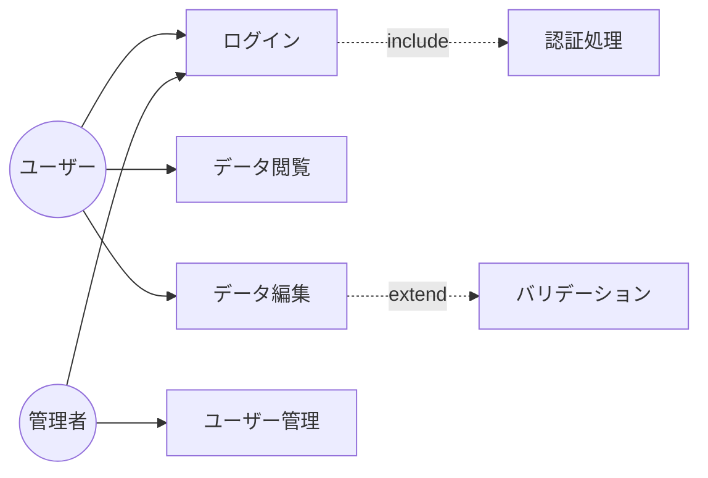
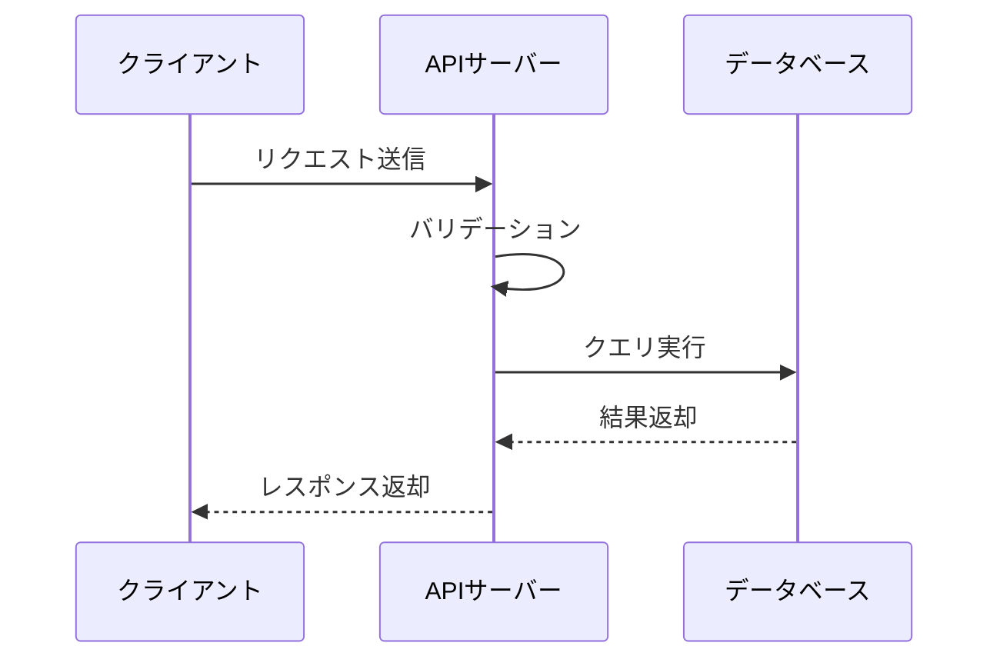
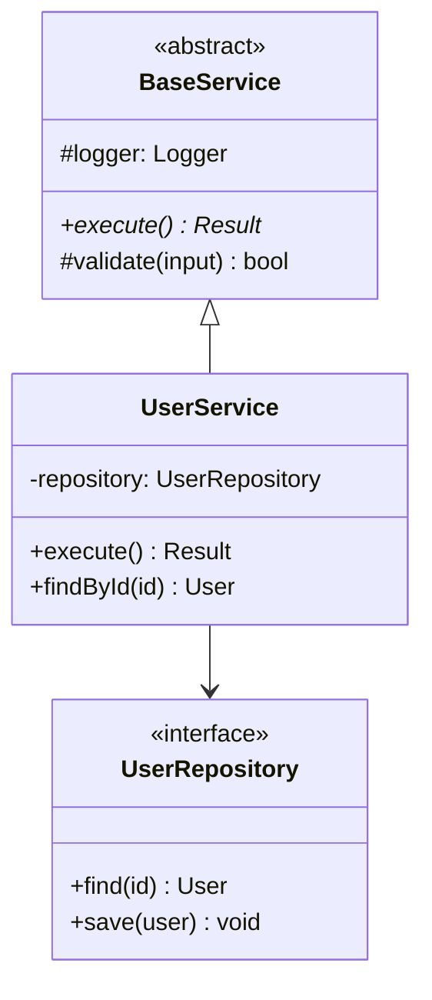
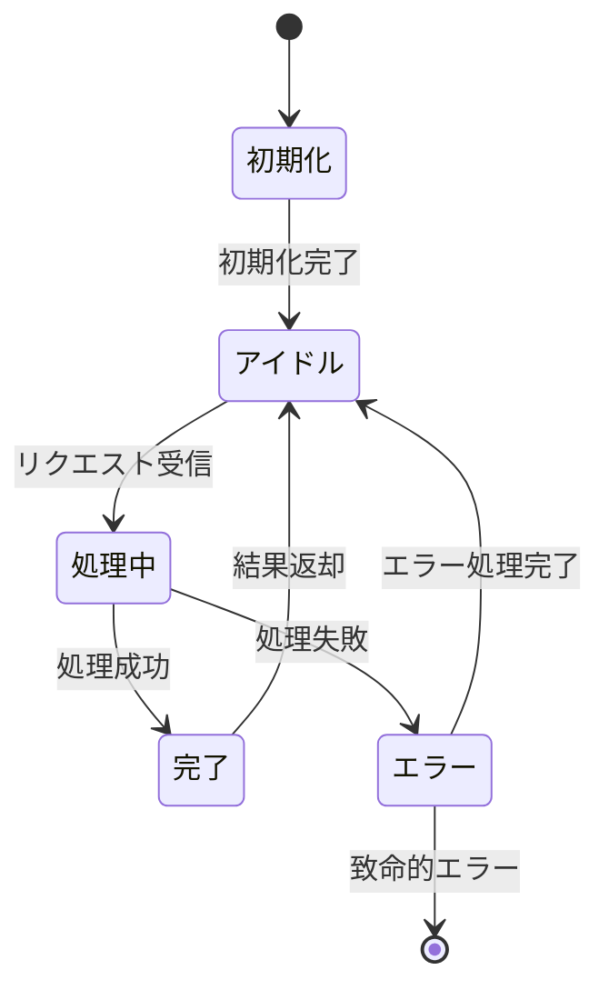

> 📊 **このファイルの役割**: Mermaid記法を用いたUML図（ユースケース、シーケンス、クラス図など）の作成ルールと標準テンプレートを定義します。

# Mermaid UML図 規約

> このファイルは `AGENTS.md` Section 10 の内容を含みます。

---

## 10. Mermaid UML図 規約

### 設計・テスト工程で使用するUML図

各工程で **Mermaid記法** を使い、以下のUML図を作成すること:

| 工程 | 必須図 | 推奨図 |
|------|--------|--------|
| SWP.1 要求仕様 | ユースケース図 | — |
| SWP.2 方式設計 | コンポーネント図、シーケンス図 | 配置図 |
| SWP.3 詳細設計 | クラス図、状態遷移図 | アクティビティ図 |
| SWP.4 単体テスト | — | シーケンス図（モック連携） |
| SWP.5 結合テスト | シーケンス図 | — |

### Mermaid記法サンプル

#### ユースケース図（要求仕様）

#### シーケンス図（方式設計・結合テスト）

#### クラス図（詳細設計）

#### 状態遷移図（詳細設計）

