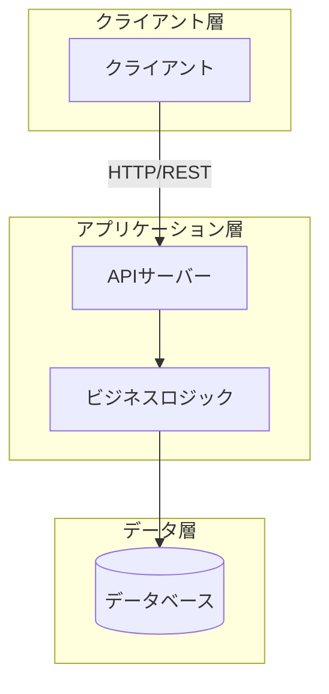
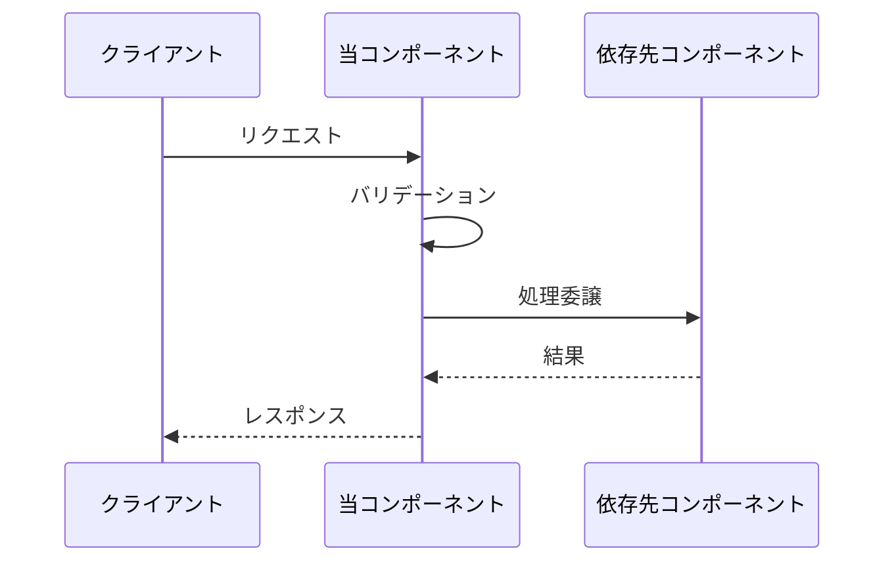
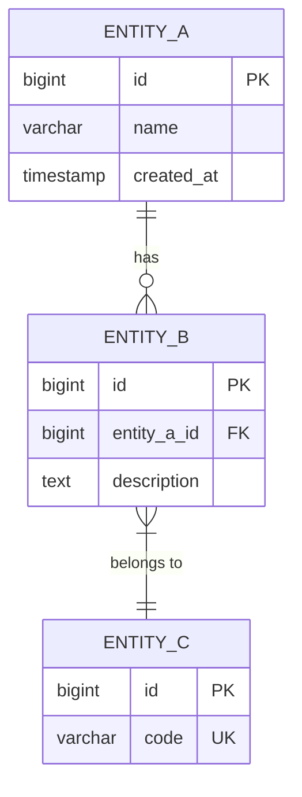

# 方式設計書テンプレート

> **テンプレート使用方法**: このファイルをコピーし、`docs/projects/<プロジェクト名>/architecture/` に配置して記入してください。

---

## 文書情報

| 項目 | 内容 |
|------|------|
| 文書ID | ARC-DOC-001 |
| プロジェクト名 | （プロジェクト名を記入） |
| バージョン | 0.1 |
| 作成日 | YYYY-MM-DD |
| 作成者 | （作成者名） |
| 最終更新日 | YYYY-MM-DD |
| ステータス | Draft / Review / Approved |
| 入力成果物 | 要求仕様書 (REQ-DOC-XXX) |

---

## 改訂履歴

| バージョン | 日付 | 変更者 | 変更内容 |
|------------|------|--------|----------|
| 0.1 | YYYY-MM-DD | — | 初版作成 |

---

## 1. 設計方針

### 1.1 設計目標

（設計で重視する品質特性を優先順位付きで記述する）

| 優先度 | 品質特性 | 説明 |
|--------|----------|------|
| 1 | （例: 保守性） | （理由） |
| 2 | （例: 性能） | （理由） |
| 3 | （例: 拡張性） | （理由） |

### 1.2 設計原則

- （適用する設計原則を列挙: SOLID、DRY、KISS等）

### 1.3 技術選定

| 区分 | 技術/ツール | 選定理由 | traces-to |
|------|-----------|----------|-----------|
| 言語 | （例: Python 3.12） | （理由） | SPEC-XXX |
| FW | （例: FastAPI） | （理由） | SPEC-XXX |
| DB | （例: PostgreSQL 16） | （理由） | SPEC-XXX |
| インフラ | （例: Docker + AWS） | （理由） | SPEC-XXX |

---

## 2. システム全体構成

### 2.1 全体構成図（Mermaid コンポーネント図）

> **記述ルール**: 実際のコンポーネントに置き換えて記述する。矢印にはプロトコルや通信方式を記載する。

### 2.2 コンポーネント一覧

| コンポーネントID | コンポーネント名 | 責務 | traces-to |
|----------------|----------------|------|-----------|
| ARC-001 | （名前） | （責務の概要） | SPEC-XXX |
| ARC-002 | （名前） | （責務の概要） | SPEC-XXX |

---

## 3. コンポーネント設計

### ARC-001: （コンポーネント名）

**責務**: （このコンポーネントが担う責務を記述する）

**traces-to**: SPEC-XXX, SPEC-XXX

#### インターフェース

| メソッド/API | 入力 | 出力 | 説明 |
|-------------|------|------|------|
| （メソッド名） | （型・パラメータ） | （戻り値） | （説明） |

#### 依存関係

- → ARC-XXX: （依存理由）

#### シーケンス図（主要ユースケース）

> **記述ルール**: 各コンポーネントの主要なユースケースについてシーケンス図を記述する。

#### 非機能考慮

- 性能: （応答時間目標等）
- エラー処理: （方針）

---

### ARC-002: （コンポーネント名）

**責務**: （責務）

**traces-to**: SPEC-XXX

（以下同様に記述）

---

## 4. データ設計

### 4.1 データモデル概要（Mermaid ER図）

> **記述ルール**: 実際のエンティティに置き換えて記述する。リレーションシップの種類（1:1, 1:N, M:N）を正確に表現する。

### 4.2 主要エンティティ

| エンティティ | 説明 | 主要属性 | traces-to |
|-------------|------|----------|-----------|
| （名前） | （説明） | （属性列挙） | SPEC-XXX |

---

## 5. インターフェース設計

### 5.1 外部インターフェース

| IF-ID | 名前 | 種別 | 相手 | プロトコル | traces-to |
|-------|------|------|------|-----------|-----------|
| IF-001 | （名前） | API/ファイル/MQ | （相手システム） | REST/gRPC等 | SPEC-XXX |

### 5.2 内部インターフェース

| IF-ID | 名前 | 呼出元 | 呼出先 | 説明 |
|-------|------|--------|--------|------|
| IF-INT-001 | （名前） | ARC-XXX | ARC-XXX | （説明） |

---

## 6. エラー処理方針

| エラー分類 | 処理方針 | ログレベル |
|-----------|---------|-----------|
| 入力バリデーション | クライアントにエラー返却 | WARN |
| ビジネスロジック | 適切なエラーコード返却 | ERROR |
| システム障害 | リトライ + アラート通知 | CRITICAL |

---

## 7. セキュリティ設計

| 対策項目 | 方式 | traces-to |
|----------|------|-----------|
| 認証 | （方式） | SPEC-NF-XXX |
| 認可 | （方式） | SPEC-NF-XXX |
| 通信暗号化 | （方式） | SPEC-NF-XXX |
| データ保護 | （方式） | SPEC-NF-XXX |

---

## 8. 設計制約・検討事項

### 8.1 設計制約

- （制約事項を列挙）

### 8.2 今後の検討事項

| 課題ID | 課題内容 | 優先度 | 担当 |
|--------|---------|--------|------|
| ISSUE-001 | （課題内容） | 高/中/低 | — |

---

## 付録: トレーサビリティ

| ARC-ID | コンポーネント名 | traces-to (SPEC) | ステータス |
|--------|----------------|------------------|-----------|
| ARC-001 | （名前） | SPEC-XXX | Draft |
| ARC-002 | （名前） | SPEC-XXX | Draft |
