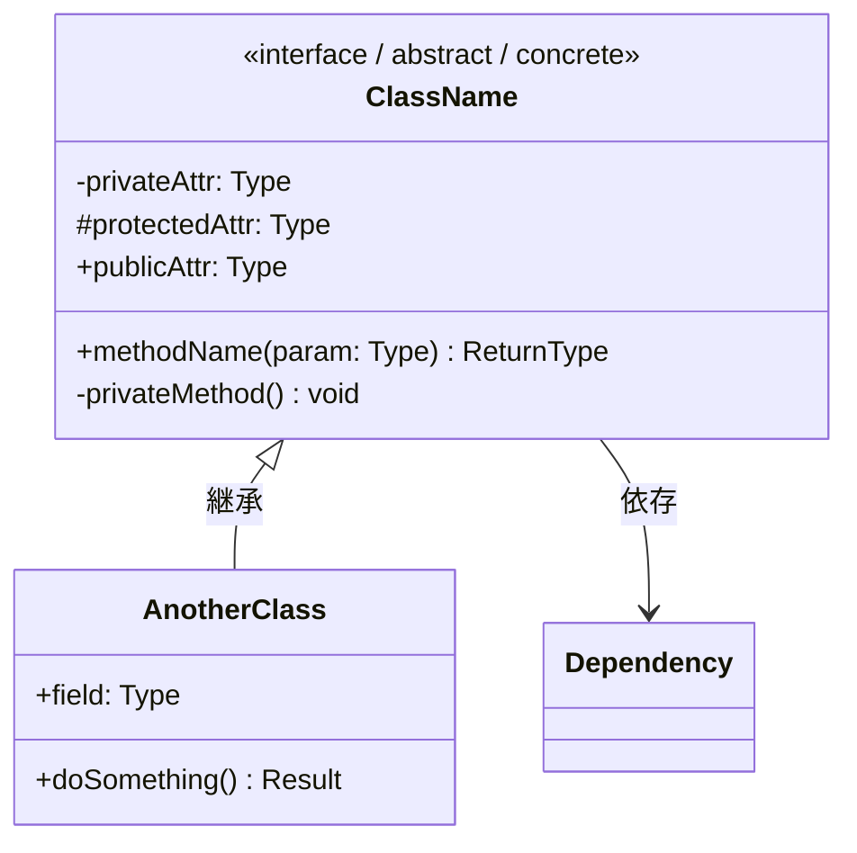
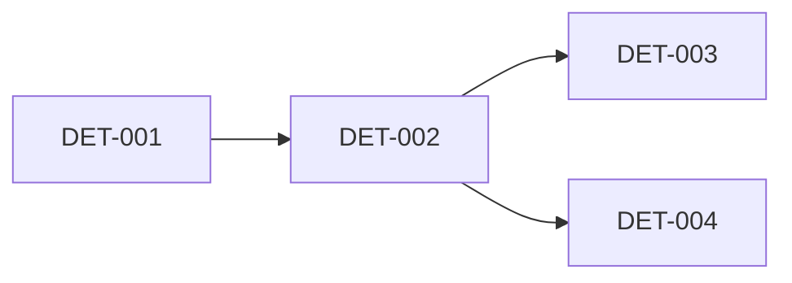
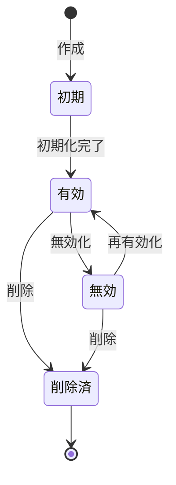

# 詳細設計書テンプレート

> **テンプレート使用方法**: このファイルをコピーし、`docs/projects/<プロジェクト名>/detailed-design/` に配置して記入してください。

---

## 文書情報

| 項目 | 内容 |
|------|------|
| 文書ID | DET-DOC-001 |
| プロジェクト名 | （プロジェクト名を記入） |
| バージョン | 0.1 |
| 作成日 | YYYY-MM-DD |
| 作成者 | （作成者名） |
| 最終更新日 | YYYY-MM-DD |
| ステータス | Draft / Review / Approved |
| 入力成果物 | 方式設計書 (ARC-DOC-XXX) |

---

## 改訂履歴

| バージョン | 日付 | 変更者 | 変更内容 |
|------------|------|--------|----------|
| 0.1 | YYYY-MM-DD | — | 初版作成 |

---

## 1. ソフトウェアの意図（日本語による詳細記述）

### 1.1 このコンポーネントが実現すること

（このソフトウェアコンポーネントが何を実現し、なぜ必要なのかを日本語で詳しく記述する。
技術的な実装方法ではなく、**ビジネス上の意図・目的・背景**を中心に記述する。
開発者がこの文書を読むだけで「なぜこの設計なのか」を完全に理解できるようにする。）

### 1.2 設計の考え方

（このモジュールを構成する際に考慮した点、選択したアプローチとその理由、
代替案を検討して棄却した経緯等を日本語で詳しく記述する。
「なぜこのクラス分割にしたのか」「なぜこのデータ構造を選んだのか」等の
設計判断の背景を記述する。）

---

## 2. 対象コンポーネント

| 項目 | 内容 |
|------|------|
| コンポーネント名 | （方式設計書のARC-XXXに対応するコンポーネント名） |
| traces-to | ARC-XXX |
| 責務 | （コンポーネントの責務を簡潔に） |

---

## 3. モジュール構成

### 3.1 クラス図（Mermaid）



> **記述ルール**: 実際のクラスに置き換えて記述する。可視性（+/-/#）を正確に表現する。

### 3.2 モジュール一覧

| モジュールID | モジュール名 | ファイルパス | 責務 | traces-to |
|-------------|-------------|-------------|------|-----------|
| DET-001 | （名前） | `src/xxx/yyy.py` | （責務） | ARC-XXX |
| DET-002 | （名前） | `src/xxx/zzz.py` | （責務） | ARC-XXX |

> **コード品質制約**: 各関数は100行以内、サイクロマティック複雑度50以内とすること（`agents/coding-standards.md` §12参照）。超過する場合は意図を変えずに関数を分割する。

### 3.3 モジュール依存関係（Mermaid）



---

## 4. モジュール詳細

> **⚠️ TDDインプット**: この章の内容は、単体テスト（SWP.4）のテストケース作成に直接使用されます。
> 関数の意図、引数の制約、戻り値、例外条件を**漏れなく詳細に**記述してください。
> テストは本設計書をインプットに先に作成し（RED）、その後実装を行います（GREEN → REFACTOR）。

### DET-001: （モジュール名）

**ファイルパス**: `src/xxx/yyy.py`

**traces-to**: ARC-XXX

#### ソフトウェアの意図

（このモジュールが何を実現するのか、なぜこの設計になっているのかを日本語で詳しく記述する。
開発者がこのモジュールの存在意義と設計意図を完全に理解できるように、
技術的な背景・ビジネスロジックの概要・想定される利用シーンを記述する。）

#### クラス設計

##### `ClassName`

**クラスの意図**: （このクラスが存在する理由と担う役割を日本語で詳しく記述する）

| 属性 | 型 | 説明 | 制約 | デフォルト値 |
|------|----|------|------|----------|
| `attribute_name` | `str` | （この属性の意図と使われ方） | 必須, 1〜255文字, 空白のみ不可 | — |
| `count` | `int` | （この属性の意図と使われ方） | 必須, 0以上, 最大999999 | `0` |

##### メソッド: `method_name(param1: Type, param2: Type) -> ReturnType`

**意図**: （このメソッドが存在する理由、何を達成するためのものか日本語で詳しく記述する。
「なぜこの処理が必要か」「呼び出し元はどのような状況でこのメソッドを使うか」も記述する。）

**パラメータ**:

| パラメータ | 型 | 意図 | 制約 | 具体例 |
|-----------|-----|------|------|--------|
| `param1` | `str` | （この引数の意図・使われ方） | 必須, 1〜100文字, ASCII英数字のみ | `"user_123"` |
| `param2` | `int` | （この引数の意図・使われ方） | 必須, 1以上1000以下 | `42` |

**戻り値**:

| 型 | 説明 | 条件 |
|----|------|------|
| `ReturnType` | （戻り値の意図と含まれる情報） | 正常処理完了時 |
| `None` | （Noneが返る場合の意図） | 該当データなしの場合 |

**処理フロー**:

1. 入力バリデーション: `param1` が制約を満たすか検証する
2. （処理ステップ2の意図と内容）
3. （処理ステップ3の意図と内容）

**例外処理** (テストケースに直結):

| 例外条件 | 例外型 | エラーメッセージ | 発生シナリオ |
|---------|--------|---------------|----------|
| `param1` が空文字 | `ValueError` | `"param1 must not be empty"` | 入力バリデーション失敗 |
| `param2` が範囲外 | `ValueError` | `"param2 must be between 1 and 1000"` | 入力バリデーション失敗 |
| DB接続エラー | `ConnectionError` | `"Database connection failed"` | 外部依存障害 |

**アルゴリズム**:（複雑なロジックがある場合）

```
INPUT: param1, param2
1. IF param1 is empty THEN raise ValueError("param1 must not be empty")
2. IF param2 < 1 OR param2 > 1000 THEN raise ValueError("param2 must be between 1 and 1000")
3. result = process(param1, param2)
4. IF result is None THEN RETURN None
5. RETURN Result(data=result)
```

**セキュリティ考慮**: （`agents/coding-standards.md` §13 に基づく考慮事項を記述）

- 入力のサニタイズ: （方法）
- SQLインジェクション対策: （方法）

---

### DET-002: （モジュール名）

**ファイルパス**: `src/xxx/zzz.py`

**traces-to**: ARC-XXX

#### ソフトウェアの意図

（同様に詳細に記述）

（以下同様に記述）

---

## 4. データ構造詳細

### 4.1 内部データ構造

| 構造名 | 種別 | フィールド | 型 | 説明 |
|--------|------|-----------|-----|------|
| （名前） | dict/class/etc | `field1` | `str` | （説明） |
|          |                | `field2` | `int` | （説明） |

### 4.2 データベーステーブル定義（該当時）

#### テーブル: `table_name`

| カラム | 型 | NULL | デフォルト | 制約 | 説明 |
|--------|-----|------|-----------|------|------|
| `id` | `BIGINT` | NO | auto | PK | 主キー |
| `name` | `VARCHAR(255)` | NO | — | — | 名前 |
| `created_at` | `TIMESTAMP` | NO | NOW() | — | 作成日時 |

**インデックス**:

| インデックス名 | カラム | 種別 | 目的 |
|-------------|--------|------|------|
| `idx_name` | `name` | BTREE | 名前検索高速化 |

---

## 6. 状態遷移（該当時）

### 状態遷移図（Mermaid）



> **記述ルール**: 実際の状態とイベントに置き換えて記述する。

### 状態遷移表

| 現在状態 | イベント | 次の状態 | アクション | traces-to |
|---------|---------|---------|-----------|-----------|
| 初期 | 作成 | 有効 | 初期化処理 | DET-XXX |
| 有効 | 削除 | 削除済 | クリーンアップ | DET-XXX |

---

## 6. エラーコード定義

| エラーコード | エラー名 | 説明 | HTTPステータス | ユーザーメッセージ |
|------------|---------|------|---------------|----------------|
| E001 | INVALID_INPUT | 入力値不正 | 400 | 入力内容を確認してください |
| E002 | NOT_FOUND | リソース未存在 | 404 | 該当データが見つかりません |

---

## 7. 設計判断・検討事項

| 判断ID | 判断内容 | 代替案 | 選定理由 |
|--------|---------|--------|----------|
| DD-001 | （判断内容） | （代替案） | （選定理由） |

---

## 付録: トレーサビリティ

| DET-ID | モジュール名 | traces-to (ARC) | ステータス |
|--------|-------------|-----------------|-----------|
| DET-001 | （名前） | ARC-XXX | Draft |
| DET-002 | （名前） | ARC-XXX | Draft |
